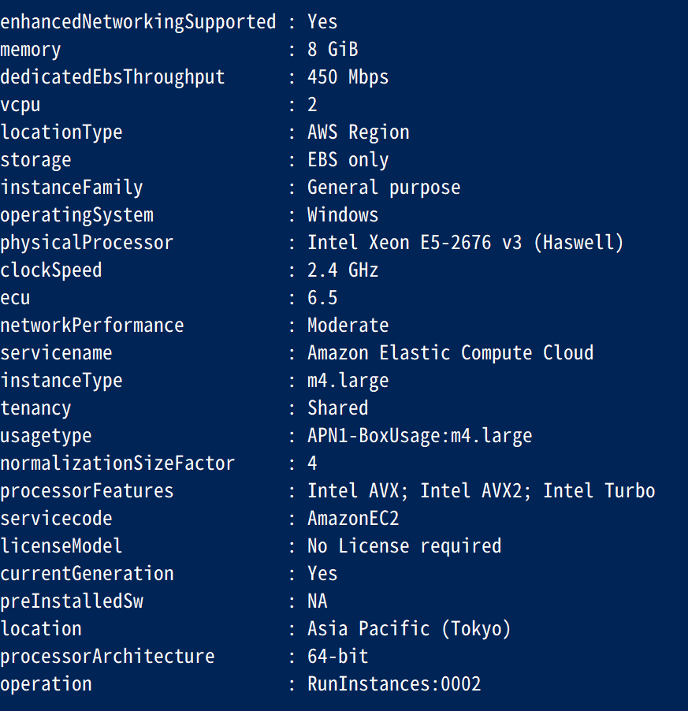
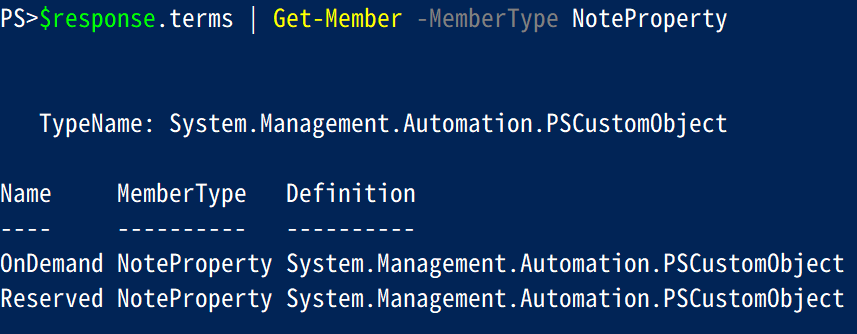

# 💎AmazonPriceListServiceで取得できるProductListのtips

AmazonPricelisetServiceで取得できるjson(ProductList)の下記項目についてのtips

- sku
- termType
- offerTermCode
- rateCode

ちなみに本資料ではAWS Tools for Windows PowerShellのGet-PLSProductコマンドでjsonファイルの取得を行っています。

## 💎sku(Stock Keeping Unit)

SKUはStock Keeping Unitでproduct(製品/サービス)の最小単位。
SKUが分かればproduct(製品/サービス)が一意となる。

PriceListServiceからAmazonEC2サービスで一つsku(A8RFGEGVBUQQDWD4)の属性を抽出してみると下記のようなっている。

attributes                  | value
--------------------------- | ----------------------------------
sku                         | A8RFGEGVBUQQDWD4
enhancedNetworkingSupported | Yes
memory                      | 8 GiB
dedicatedEbsThroughput      | 450 Mbps
vcpu                        | 2
locationType                | AWS Region
storage                     | EBS only
instanceFamily              | General purpose
operatingSystem             | Windows
physicalProcessor           | Intel Xeon E5-2676 v3 (Haswell)
clockSpeed                  | 2.4 GHz
ecu                         | 6.5
networkPerformance          | Moderate
servicename                 | Amazon Elastic Compute Cloud
instanceType                | m4.large
tenancy                     | Shared
usagetype                   | APN1-BoxUsage:m4.large
normalizationSizeFactor     | 4
processorFeatures           | Intel AVX; Intel AVX2; Intel Turbo
servicecode                 | AmazonEC2
licenseModel                | No License required
currentGeneration           | Yes
preInstalledSw              | NA
location                    | Asia Pacific (Tokyo)
processorArchitecture       | 64-bit
operation                   | RunInstances:0002



ちなみに上記のようにAmazonEC2サービスでSKUが一意となるようにGet-ProductListコマンドから情報を取得するには下記項目でフィルタを行えば良さそう。

フィルタ項目    | 値
--------------- | --------------------
servicecode     | AmazonEC2
InstanceType    | m4.large
preInstalledSw  | NA
operatingSystem | Windows
tenancy         | Shared
licenseModel    | No License required
location        | Asia Pacific (Tokyo)

AWS Tools for Windows PowerShellのGet-PLSProductを上記条件で利用するサンプルコード

```Powershell
#フィルタ条件の設定
$filter = @()
$filter += @{Type="TERM_MATCH";Field="instanceType";Value="m4.large"}
$filter += @{Type="TERM_MATCH";Field="preInstalledSw";Value="NA"}
$filter += @{Type="TERM_MATCH";Field="location";Value="Asia Pacific (Tokyo)"}
$filter += @{Type="TERM_MATCH";Field="operatingSystem";Value="Windows"}
$filter += @{Type="TERM_MATCH";Field="tenancy";Value="Shared"}
$filter += @{Type="TERM_MATCH";Field="licenseModel";Value="No License required"}
#実行
$response = Get-PLSProduct -ServiceCode AmazonEC2 -filter $filter -Region us-east-1 | convertFrom-json

#製品情報の表示
$response.product.attributes | Format-List *

```

AmazonEC2のskuは同一スペックであってもリージョンが別になれば、もちろんskuは別になります。
上記フィルタからロケーション情報を外すと下記のようなデータが取得できる。(項目は一部抜粋)

sku              | location                  | instanceType
---------------- | ------------------------- | ------------
2Y3VM8E6YQFTZSDU | Asia Pacific (Sydney)     | m4.large
3KAH8K69VSEHVQ72 | South America (Sao Paulo) | m4.large
JNKR5A8MT8R88DJ  | AWS GovCloud (US)         | m4.large
A8RFGEGVBUQQDWD4 | Asia Pacific (Tokyo)      | m4.large
AP8CRXEFDUCGR7QY | US East (N. Virginia)     | m4.large
HGZADV6Y7JDA6NB7 | Canada (Central)          | m4.large
HS8ZKPFW9GAP2BRZ | US West (Oregon)          | m4.large
MWFZC9GQ79EAVX8K | Asia Pacific (Seoul)      | m4.large
NVHKDTE7VDZH4675 | Asia Pacific (Singapore)  | m4.large
PPQT6JJ737VYRTVW | EU (London)               | m4.large
SX6NECXKKXVNTAFZ | US West (N. California)   | m4.large
U79P59H9M7K9MAG7 | EU (Ireland)              | m4.large
URZRPRYPZ6U86JCD | EU (Frankfurt)            | m4.large
VC2BBD4RTJM8XTNZ | US East (Ohio)            | m4.large
YF92B5KBDDWZ6V74 | Asia Pacific (Mumbai)     | m4.large

## 💎termType

AmazonPriceLisetServiceでは製品(サービス)に紐づく形でそれぞれtermが存在する。
termTypeにはonDemandとreservedが存在し、それぞれofferTermCodeが紐付いていく。

リザーブドを提供していない製品の場合はOndemandのみになります。



## 💎offerTermCode

offerTermCodeはtermTypeに紐づく項目でAmazonのサービス毎にそれぞれの体系をもっているようです。

2017年12月現在のAmazonEC2サービスでregionがap-northeast-1(tokyo)では下記のような一覧になっている様子。

termType | OfferTermCode | LeaseContractLength | OfferingClass | PurchaseOption
-------- | ------------- | ------------------- | ------------- | ---------------
reserved | VJWZNREJX2    | 1yr                 | convertible   | All Upfront
reserved | 7NE97W5U4E    | 1yr                 | convertible   | No Upfront
reserved | CUZHX8X6JH    | 1yr                 | convertible   | Partial Upfront
rserved  | 6QCMYABX3D    | 1yr                 | standard      | All Upfront
reserved | 4NA7Y494T4    | 1yr                 | standard      | No Upfront
reserved | HU7G6KETJZ    | 1yr                 | standard      | Partial Upfront
reserved | MZU6U2429S    | 3yr                 | convertible   | All Upfront
reserved | Z2E3P23VKM    | 3yr                 | convertible   | No Upfront
reserved | R5XV2EPZQZ    | 3yr                 | convertible   | Partial Upfront
reserved | NQ3QZPMQV9    | 3yr                 | standard      | All Upfront
reserved | BPH4J8HBKS    | 3yr                 | standard      | No Upfront
reserved | 38NPMPTW36    | 3yr                 | standard      | Partial Upfront
onDemand | JRTCKXETXF    | -                   | -             | -

AmazonEC2,tokyo regionでreservedに存在するtermTypeの一覧を抽出するサンプルコード

```Powershell
#東京リージョン指定のフィルタ作成
$filter = @()
$filter += @{Type="TERM_MATCH";Field="location";Value="Asia Pacific (Tokyo)"}

#AmazonEC2サービスで東京リージョンのPriceListServiceを取得
$response = Get-PLSProduct -ServiceCode AmazonEC2 -filter $filter -Region us-east-1 | convertFrom-json

#取得したPricelistServiceのReservedからtermの一覧を作成
$uniqueTerms = ($response.terms.reserved | ForEach-Object{ $_.psobject.properties.value | Select-Object offertermcode ,termAttributes }) | Sort-Object offerTermCode -Unique

#表示
$uniqueTerms | Format-Table *
```

### 参考資料：AmazonEC2以外(AmazonDynamoDB)のofferTermCode

AmazonDynamoDBではofferTermCodeは下記のような体系になっているっぽい。

OfferTermCode | LeaseContractLength | OfferingClass | PurchaseOption
------------- | ------------------- | ------------- | -----------------
JRTCKXETXF    |                     |               |
YTVHEVGPBZ    | 1yr                 | standard      | Heavy Utilization
VG8YD49WWM    | 3yr                 | standard      | Heavy Utilization

## 💎rateCode

rateCodeはskuとofferTermCodeに紐づくコードで下記の体系となっている。

sku.offerTermCode.XXXXXXXXXX

rateCodeが単位価格と紐付いている。

一例として下記のrateCodeをみてみる。

- `A8RFGEGVBUQQDWD4.JRTCKXETXF.6YS6EN2CT7`

### sku部分のA8RFGEGVBUQQDWD4から解ること

sku:A8RFGEGVBUQQDWD4で製品が確定し下記の事がわかる。

filterField     | value
--------------- | --------------------
servicecode     | AmazonEC2
InstanceType    | m4.large
preInstalledSw  | NA
operatingSystem | Windows
tenancy         | Shared
licenseModel    | No License required
location        | Asia Pacific (Tokyo)

### offerTermCode部分のJRTCKXETXFから解ること

offerTermCode:JRTCKXETXFでonDemandである事がわかる。

### XXXXXXXXXXの6YS6EN2CT7から解ること

6YS6EN2CT7の部分については特に呼称等が見当たらなかったので不明。
本資料ではとりえずとして？？？と表記しています。

rateCodeからは紐づくskuとoffertermCodeが単位量(時間や回数)辺りでいくらの単価かという事がわかります。
この組み合わせ等はサービスや製品毎に異なっているようです。

#### AmazonEC2サービスのtermTypeがonDemandeの場合

2017年12月現在AmazonEC2サービスでregionがap-northeast-1(tokyo)でonDemandの？？？の部分にどのような物が存在するか観察してみると。

下記のようになっているようです。

rateCodeに示されている単価はHrs(時間単位)でbeginRangeが0でendRangeがInfinityという事で0からInfinityまで対象という事を表しています。

？？？     | unit | beginRange | endRanges
---------- | ---- | ---------- | ---------
6YS6EN2CT7 | Hrs  | 0          | Inf

#### AmazonEC2サービスのTermTypeがreservedの場合

2017年12月現在AmazonEC2サービスでregionがap-northeast-1(tokyo)でreservedの？？？の部分どのような物が存在するか観察してみると。
下記のようになっており、2TG2D8R56UのUpfront Feeはリザーブド購入時の前払費用を意味しています。
6YS6EN2CT7の意味合いについてはonDemandと同様。

？？？     | unit     | beginRange | endRange | description
---------- | -------- | ---------- | -------- | -----------
2TG2D8R56U | Quantity | -          | -        | Upfront Fee
6YS6EN2CT7 | Hrs      | 0          | Inf      | -

### 参考資料：AmazonEC2以外(AmazonCloudSearch)のrateCodeを観察してみる

AmazonCloudSearchの下記に紐づくrateCodeを観察してみる。

- skuが26QEBRK9G26R9UG4
- offerTermCodeがJRTCKXETXF

上記に紐づくrateCodeの？？？の部分は下記のようになっており。

利用時間が0から750までは'26QEBRK9G26R9UG4.JRTCKXETXF.TKQXKGP374'のrateCode単価が適用。
利用時間が750からInfinityまでは'26QEBRK9G26R9UG4.JRTCKXETXF.9GF73R9NUV'のrateCode単価が適用。

のような事がわかる。

？？？     | unit | beginRange | endRange
---------- | ---- | ---------- | --------
TKQXKGP374 | Hrs  | 0          | 750
9GF73R9NUV | Hrs  | 750        | Inf

ちなみにAmazonCloudSerchのratecode中に出てくる？？？の一覧としては下記のようになっているようです。

？？？     | unit    | beginRange | endRange
---------- | ------- | ---------- | --------
A6VD9GXV7W | Request | 0          | 10000
B536CJ4M58 | Request | 10000      | Inf
TKQXKGP374 | Hrs     | 0          | 750
9GF73R9NUV | Hrs     | 750        | Inf
6YS6EN2CT7 | Hrs     | 0          | Inf
ZRBZXHZTV5 | GB      | 0          | 50
HVPRRUAXWE | GB      | 50         | Inf

## 💎総評

Amazonの膨大なproductごとに存在するskuと各サービスの提供方法ごとに存在するofferTermCodeと単位価格ごとに存在する？？？が組み合わさることによって。

ProductListのrateCodeは組み合わせ爆発！

元々ProductListは各サービスの全リージョン纏めてしか取得状況から、各サービスの各リージョン毎のProductListが取得できるようになり、さらにGet-PLSProduct等の細かい単位で情報を取得できるようになり少しは救われてはいますが。

膨大な価格テーブルの中からお目当ての情報をゲットするには、それはそれでテクニックが必要な気がします。
